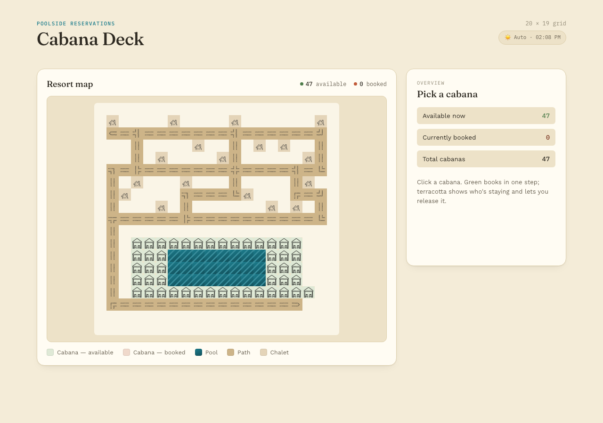

# Cabana Deck

An interactive resort map for browsing and booking poolside cabanas — a REST API backend (.NET) and a React frontend, served together from one process.



## Quick start

**Prerequisites:** .NET SDK 10.0+, Node.js 22+

```
./run.sh
```

This builds the frontend and starts the backend on `http://localhost:5250` (see `backend/Properties/launchSettings.json`), serving the API, the built frontend, and the map tile assets from one origin. Open that URL in a browser.

By default it reads `map.ascii` and `bookings.json` from the repo root. To use different files:

```
./run.sh --map path/to/your-map.ascii --bookings path/to/your-bookings.json
```

To pick a specific port, pass `--urls`:

```
./run.sh --urls http://localhost:5299
```

## How to use it

- The map renders from the legend: `W` cabana, `p` pool, `#` path, `c` chalet, `.` empty space.
- Click a **green** cabana to book it — enter a room number and guest name, confirm. The tile updates immediately.
- Click a **terracotta** (booked) cabana to see who's staying there and release it.
- A room number + guest name only books/releases a cabana if that pair matches a real guest in `bookings.json` — there's no separate login (see Design decisions below).

## Running the tests

Backend (xUnit — map parsing, booking/cancel logic, full HTTP API):

```
dotnet test backend.Tests/ResortMap.Api.Tests.csproj
```

Frontend (Vitest + React Testing Library — map rendering, book/error/cancel flows):

```
cd frontend && npm install && npm test -- --run
```

Both suites also run automatically in CI on every push/PR (`.github/workflows/ci.yml`).

## Project layout

```
backend/           ASP.NET Core Web API — map parsing, in-memory booking state, REST endpoints, static file hosting
backend.Tests/     xUnit unit + integration tests for the backend
frontend/          Vite + React + TypeScript SPA, builds into backend/wwwroot
assets/            Map tile art (provided) — served by the backend at /assets
map.ascii          Default resort map
bookings.json      Default guest roster (room number + name pairs) used to validate bookings
run.sh             Single entrypoint: builds the frontend, starts the backend
```

## API

- `GET /api/map` → `{ width, height, grid: string[], cabanas: [{id, row, col, available, room?, guestName?}] }`
- `POST /api/bookings` `{ cabanaId, room, guestName }` → `200` on success, `400` if the guest isn't in the roster, `409` if already booked, `404` if the cabana doesn't exist
- `DELETE /api/bookings/{cabanaId}` `{ room, guestName }` → `200` on success, `400` if room/name don't match the existing booking, `409` if it isn't booked

## Design decisions & trade-offs

**Single process, single origin.** The backend serves the built frontend (`wwwroot`) and the map tile `assets/` folder alongside the API, so there's one command, one port, and no CORS configuration to reason about. The trade-off is a build step before the backend can serve anything useful in production mode — acceptable for a project this size, and `run.sh` hides it behind one command anyway.

**In-memory booking state, no database.** Cabana availability lives in a `ConcurrentDictionary` seeded from the parsed map at startup and resets on restart — explicitly allowed by the brief, and the honest choice for a stateless demo instead of standing up persistence nobody asked for. `bookings.json` is a guest roster used only to *validate* a room+name pair, not a booking ledger — a guest isn't "used up" after one booking, since nothing in the spec says a guest can only hold one cabana.

**No real auth.** Per the brief, knowing a room number and guest name is treated as sufficient authorization to book *or* release a cabana — releasing checks the same pair against the cabana's current booking, so a guest can't release someone else's cabana by guessing an ID.

**A side panel instead of a modal.** Clicking a cabana swaps the content of a persistent right-hand rail rather than opening an overlay — the map is never covered, and the whole interaction (see availability → book or release → confirmation) happens without navigating away or losing your place. This was deliberately validated as a UI/UX mockup before any of it was implemented.

**Release/cancel endpoint beyond the literal spec.** The brief only asks for booking, but a booking flow without any way to undo a mistake felt incomplete, and the no-real-auth model extends naturally to it (same room+name check). Kept minimal on purpose — no admin view, no booking history.

**What was kept simple / skipped:** no pagination or filtering (the map is small enough to render whole), no optimistic UI rollback beyond a plain error message on failure, no accessibility work beyond keyboard-operable cabana tiles and semantic buttons/labels, no visual distinction for map tiles beyond the legend's four types.

## AI-assisted workflow

See [AI.md](AI.md) for how this was built with Claude Code, including the planning and design steps taken before writing code.
